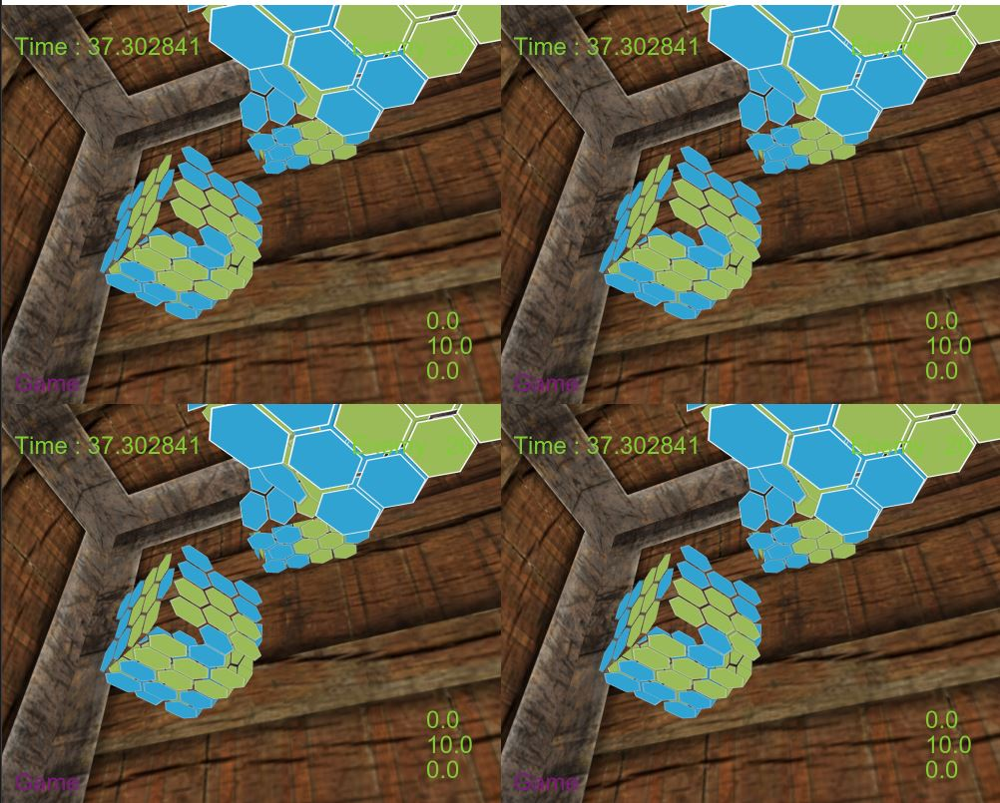
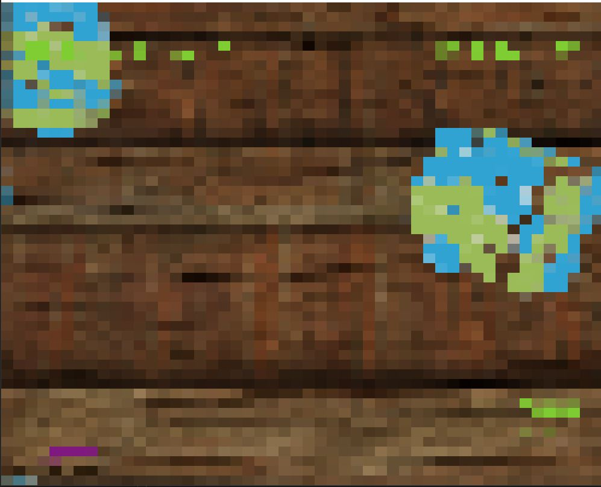
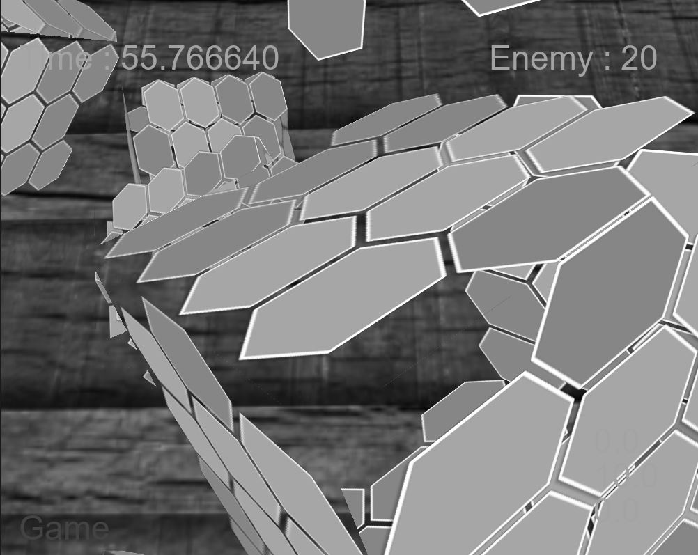

# OpenGLプロジェット

## 使用言語, ツール
C++, GLSL
Visual Studio 2019, VS Code

## 使用ライブラリ
[GLFW3](https://www.glfw.org/),
[glad](https://glad.dav1d.de/),
[glm](https://github.com/g-truc/glm),
[std_image](https://github.com/nothings/stb),
[FreeType](https://www.freetype.org/)

## 参考サイト
[Learn opengl](https://learnopengl.com/)

# ゲーム画面
<center>
   
</center>

## 説明
1. W,S,A,Sでカメラ移動
2. マウス移動でカメラ回転
3. Time(左上)が0になったらゲームオーバー
4. Enemy(右上)キューブの数
5. 右下(Canera position) 上からｘ、ｙ、ｚ
6. キューブに当たったらキューブは消える。（Enemyの数字が減少する）

# 当たり判定
```cpp
bool Game::CollisionAABB(Cube* Target, Cube* box)
{
	return (Target->GetMinPos().x <= box->GetMaxPos().x && Target->GetMaxPos().x >= box->GetMinPos().x) &&
		(Target->GetMinPos().y <= box->GetMaxPos().y && Target->GetMaxPos().y >= box->GetMinPos().y) &&
		(Target->GetMinPos().z <= box->GetMaxPos().z && Target->GetMaxPos().z >= box->GetMinPos().z);
}
```

# post processing
<center></center>

## 説明
マウス右左クリックでShaderを変更
## 適用の流れ
1. FrameBuffer生成
2. Sceneを描く場所を指定(**生成したFrameBuffer**)
3. 指定したFrameBufferにGameSceneを描いて保存
4. **生成**したFrameBufferを**default** FrameBufferに変更
5. PostProcessingを適用したいなオブジェクト生成（四角形）
6. 四角形にTexture(**別のFrameBuffer保存されているScene**)適用する
7. そしてShaderを適用する

## C++(Main.cpp)
```cpp
	while (!glfwWindowShouldClose(window))
	{
		gametime.Time_Measure();
   		scrennRender->use();

		game->SetCameraPos(camera.Position);
		game->Update(gametime.GetDeltaTime());
		game->Draw(projection, view);
		
		scrennRender->free();
		_quad->SetTexture(scrennRender->GetTextureColorbuffer());
		_quad->Draw();

		gametime.DeltaTime_Update();
		glfwSwapBuffers(window);
		glfwPollEvents();
	}
```

## vertex shader
```glsl
#version 330 core
out vec4 FragColor;

in vec2 TexCoords;

uniform sampler2D screenTexture;
uniform float Time;

void main()
{
    vec2 temp = TexCoords;
    temp.x += 0.5f;
    vec3 col = texture(screenTexture, TexCoords + sin(Time)).rgb;

    FragColor = vec4(col, 1.0f);
}
```

## fragmant shader
```glsl
#version 330 core
layout (location = 0) in vec3 aPos;
layout (location = 1) in vec2 aTexCoords;

out vec2 TexCoords;

void main()
{
    TexCoords = aTexCoords;
    gl_Position = vec4(aPos.x, aPos.y, 0.0f, 1.0f);
}
```

# その外(post processing)
</center> -->
## 画面分割
<center></center>

## モザイク
<center></center>

## グレースケール
<center></center>